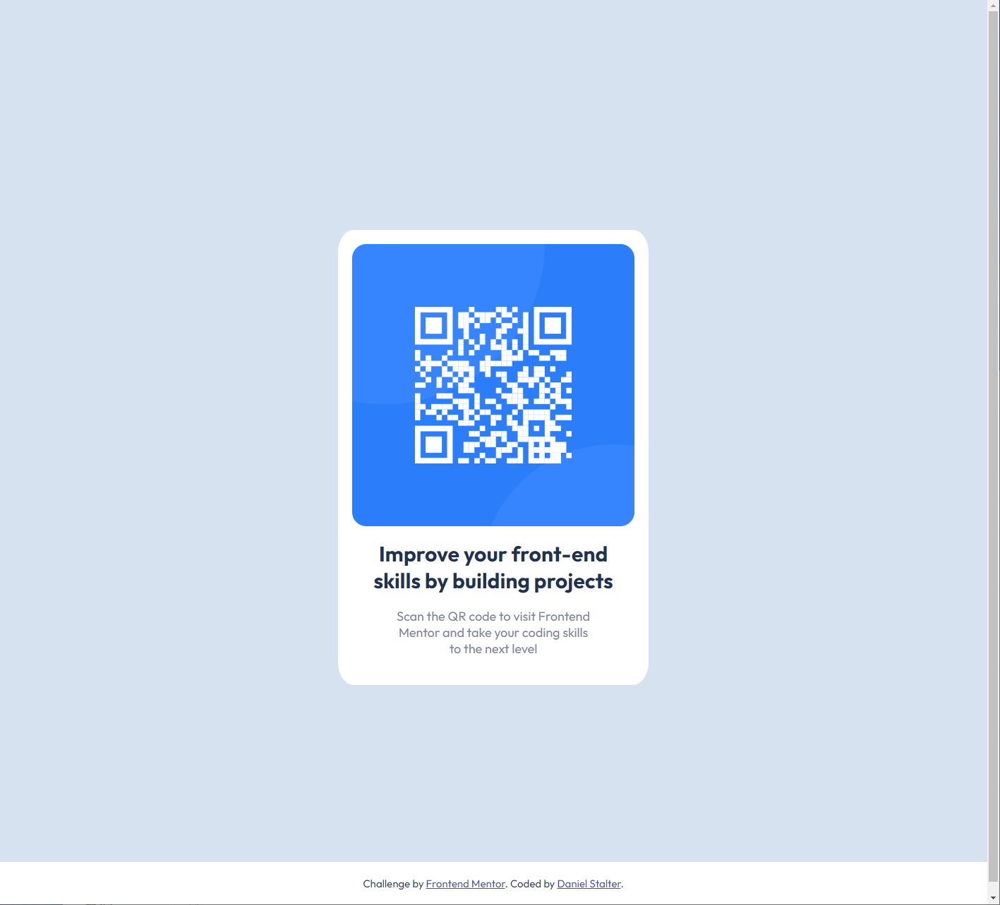

# Frontend Mentor - QR code component solution

This is a solution to the [QR code component challenge on Frontend Mentor](https://www.frontendmentor.io/challenges/qr-code-component-iux_sIO_H). Frontend Mentor challenges help you improve your coding skills by building realistic projects. 

## Table of contents

- [Overview](#overview)
  - [Screenshot](#screenshot)
  - [Links](#links)
- [My process](#my-process)
  - [Built with](#built-with)
  - [What I learned](#what-i-learned)
  - [Continued development](#continued-development)
  - [Useful resources](#useful-resources)
- [Author](#author)

## Overview

### Screenshot

### Links

- Solution URL: [https://dannystalter.github.io/QR-Code-Component/](https://dannystalter.github.io/QR-Code-Component/)

## My process

### Built with

- Semantic HTML5 markup
- CSS custom properties
- Flexbox

### What I learned

This challenge was a great refresher on CSS styling and becoming reacquainted with Flexbox. Centering the content on the page becomes much easier using Flexbox. I also practiced importing fonts of specific weights from Google Fonts.

### Continued development

I would like to keep practicing Flexbox and start working on Grid to become more comfortable with using both for my layouts.

### Useful resources

- [W3Schools](https://www.w3schools.com/css/) - I was referencing W3Schools often to help refresh my knowledge on different types of CSS stylings.
- [MDN Web Docs](https://developer.mozilla.org/en-US/docs/Web/CSS/CSS_flexible_box_layout/Aligning_items_in_a_flex_container) - This site helped me to align items in a flex container.

## Author

- GitHub - [DannyStalter](https://github.com/DannyStalter)
- Frontend Mentor - [@DannyStalter](https://www.frontendmentor.io/profile/DannyStalter)
